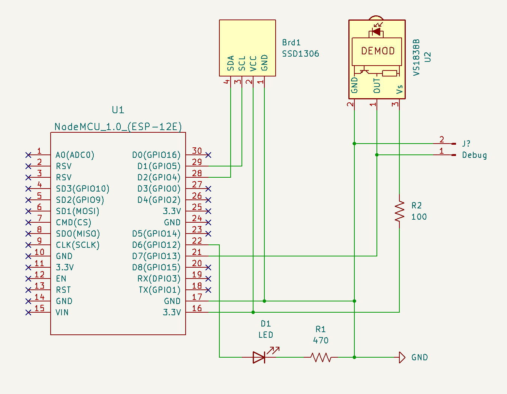
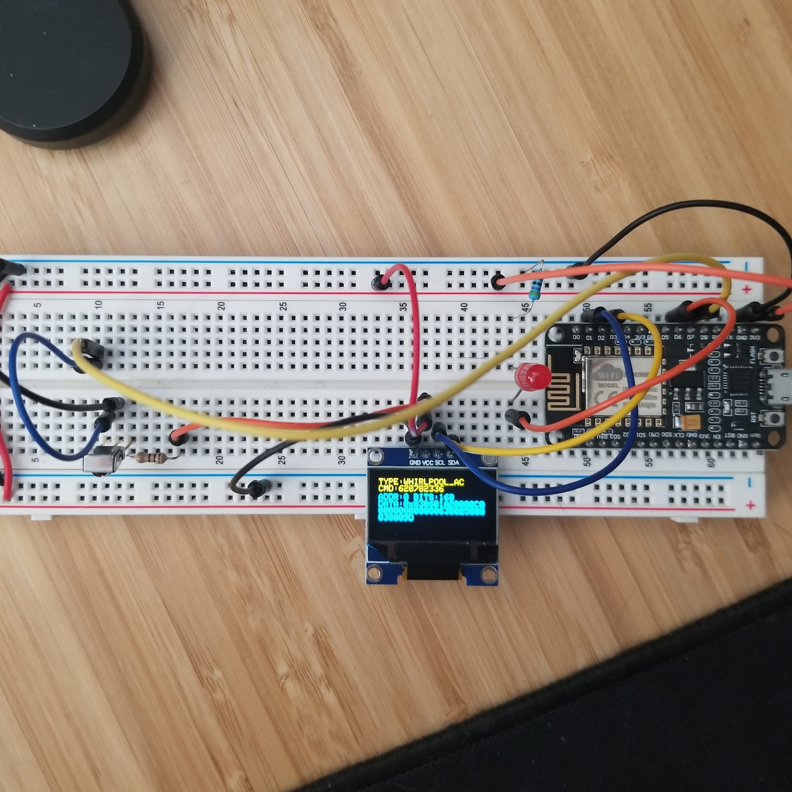
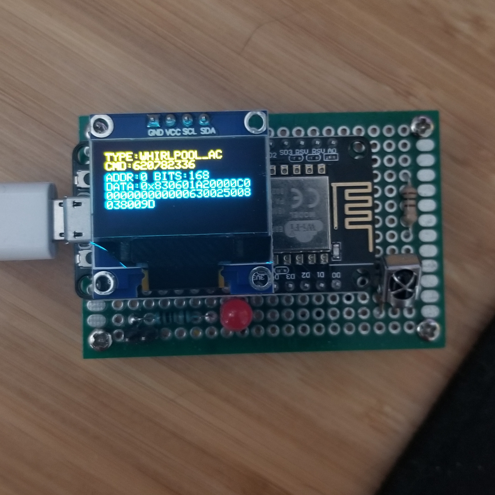

# ir-sniffer

Quick and dirty 38kHz IR sniffer

I threw this together because I wanted a braindead simple way to sniff IR data. 
This is pretty much just the receiver dump demos in [IRremoteESP8266](https://github.com/crankyoldgit/IRremoteESP8266/tree/master)
except I output to OLED as well as serial port.

I'm currently using this to sniff my air conditioning unit's remote commands so I can control it through Home-Assistant.
Also, who knows maybe I'll need something like this in the future for some other dumb thing I make.

## Parts List

- 1x ESP8266
- 1x VS1838B IR sensor
- 1x SSD1306 mini OLED
- 1x 470Ω resistor
- 1x 100Ω resistor
- 4x M2.5x10mm brass standoff
- 4x M2.5x6mm screw
- 2x Male header

## Circuit

<a href="images/schematic-cropped.png"></a>

<a href="images/breadboard.jpg"></a>

<a href="images/protoboard.jpg"></a>

## IR Samples

### TV Remote

```txt
Protocol  : NEC
Code      : 0x61A030CF (32 Bits)

As Source Code:
uint16_t rawData[67] = {8998, 4494,  596, 546,  596, 1672,  596, 1672,  596, 
                        546,  596, 546,  596, 546,  596, 544,  596, 1672,  596, 
                        1672,  596, 546,  596, 1672,  596, 546,  594, 548,  594, 
                        546,  596, 546,  596, 546,  596, 546,  596, 546,  596, 
                        1672,  596, 1672,  596, 544,  596, 546,  596, 546,  596, 
                        546,  596, 1672,  596, 1672,  596, 546,  594, 548,  596, 
                        1672,  594, 1674,  596, 1672,  596, 1672,  596};  // NEC 61A030CF
uint32_t address = 0x586;
uint32_t command = 0xC;
uint64_t data = 0x61A030CF;
```

### AC Unit

```txt
Protocol  : WHIRLPOOL_AC
Code      : 0x830601A20000C0000000000000630025008028008D (168 Bits)
Mesg Desc.: Model: 2 (DG11J191), Power Toggle: Off, Mode: 2 (Cool), Temp: 26C, 
            Fan: 1 (High), Swing: Off, Light: On, Clock: 00:00, On Timer: Off, 
            Off Timer: Off, Sleep: Off, Super: Off, Command: 37 (UNKNOWN)

As Source Code:
uint16_t rawData[343] = {9056, 4472,  612, 1638,  636, 1616,  612, 522,  638, 498,  
                        612, 528,  638, 504,  612, 534,  638, 1622,  638, 488,  638, 
                        1614,  638, 1618,  638, 500,  638, 502,  612, 532,  638, 510, 
                        636, 500,  638, 1610,  638, 492,  638, 494,  638, 498,  638, 
                        504,  638, 506,  638, 510,  612, 524,  638, 488,  612, 1642,  
                        616, 518,  640, 498,  638, 502,  638, 1628,  612, 536,  638, 
                        1622,  638, 488,  616, 514,  638, 494,  612, 524,  614, 526,  
                        636, 506,  612, 534,  612, 524,  638, 488,  618, 512,  638, 
                        496,  638, 498,  638, 502,  638, 506,  636, 510,  612, 506,  
                        614, 7946,  640, 486,  638, 492,  638, 496,  636, 500,  636, 
                        502,  636, 506,  638, 1632,  638, 1622,  638, 488,  612, 518,  
                        636, 496,  636, 498,  638, 502,  638, 506,  638, 508,  612, 524,  
                        612, 514,  612, 518,  612, 520,  612, 524,  638, 500,  638, 506,  
                        638, 510,  612, 524,  638, 488,  614, 518,  612, 522,  638, 500,  
                        638, 502,  638, 506,  638, 510,  614, 524,  638, 488,  636, 492,  
                        612, 522,  636, 500,  638, 502,  612, 532,  638, 510,  612, 524,  
                        638, 490,  636, 492,  612, 522,  638, 498,  612, 528,  612, 530,  
                        640, 508,  612, 524,  638, 488,  636, 494,  638, 494,  638, 500,  
                        638, 502,  638, 506,  622, 524,  636, 500,  638, 1612,  638, 1616,  
                        638, 496,  638, 498,  612, 528,  612, 1654,  612, 1658,  612, 506,  
                        614, 7946,  640, 488,  636, 494,  636, 496,  638, 498,  638, 504,  
                        638, 506,  638, 510,  620, 516,  612, 1638,  638, 492,  640, 1618,  
                        614, 524,  638, 502,  638, 1630,  638, 508,  612, 524,  638, 488,  
                        640, 490,  638, 494,  638, 498,  638, 502,  638, 506,  636, 508,  
                        638, 498,  638, 488,  636, 494,  638, 494,  638, 498,  612, 528,  
                        614, 530,  638, 508,  638, 1622,  640, 488,  612, 518,  638, 496,  
                        638, 1622,  638, 502,  638, 1630,  610, 536,  638, 500,  638, 488,  
                        612, 516,  638, 496,  612, 524,  638, 502,  638, 506,  618, 530,  
                        612, 524,  636, 1612,  638, 492,  638, 1618,  636, 1626,  636, 502,  
                        638, 504,  640, 508,  638, 1606,  602};  // WHIRLPOOL_AC
uint8_t state[21] = {0x83, 0x06, 0x01, 0xA2, 0x00, 0x00, 0xC0, 0x00, 0x00, 0x00, 0x00, 0x00, 
                    0x00, 0x63, 0x00, 0x25, 0x00, 0x80, 0x28, 0x00, 0x8D};
```

### Roku Remote

```txt
Protocol  : NEC
Code      : 0x574354AB (32 Bits)

As Source Code:
uint16_t rawData[135] = {9024, 4344,  578, 544,  576, 1666,  576, 544,  578, 1668,  578, 542,  
                        578, 1664,  578, 1664,  578, 1668,  576, 544,  578, 1666,  578, 546,  
                        578, 546,  578, 546,  578, 544,  576, 1664,  578, 1668,  578, 544,  
                        576, 1668,  576, 544,  578, 1666,  578, 544,  576, 1668,  578, 544,  
                        578, 544,  576, 1668,  578, 544,  576, 1668,  578, 542,  578, 1668,  
                        578, 542,  576, 1666,  576, 1658,  578, 40434,  9012, 4356,  564, 576,  
                        546, 576,  546, 578,  546, 576,  546, 574,  546, 1698,  546, 1696,  548, 
                        1698,  546, 576,  546, 576,  546, 576,  546, 576,  546, 576,  546, 574,  
                        546, 1696,  546, 1700,  546, 574,  546, 1698,  548, 576,  546, 574,  546, 
                        1696,  546, 1698,  546, 576,  546, 576,  546, 1698,  548, 574,  546, 1696,  
                        546, 1698,  546, 576,  546, 574,  546, 1696,  548, 1686,  546};  // NEC 574354AB
uint32_t address = 0xC2EA;
uint32_t command = 0x2A;
uint64_t data = 0x574354AB;
```

## References

- https://github.com/crankyoldgit/IRremoteESP8266/tree/master
- https://www.commandfusion.com/irdatabase
